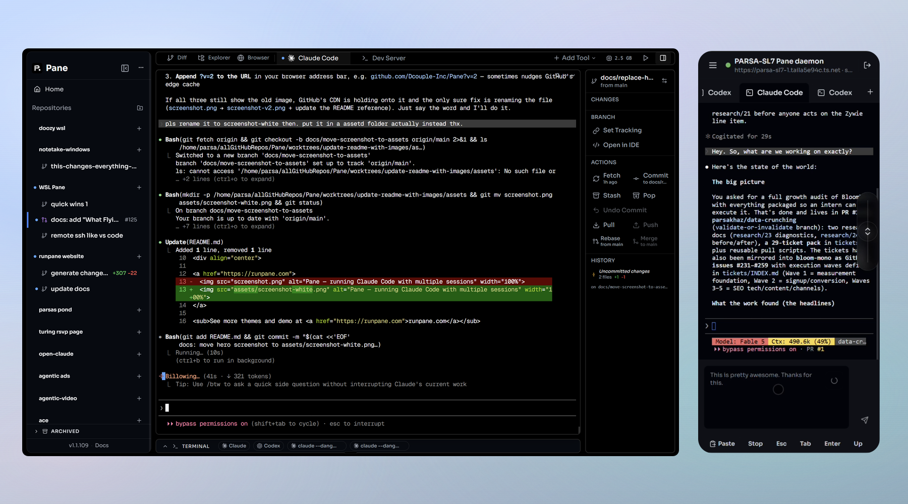

<p align="center">
  
</p>

<p align="center">
  <strong>Run any coding agent, on any OS, from desktop <a href="#remote-pane">or phone</a>.</strong><br>
  <em>just terminals. no abstractions.</em>
</p>

<div align="center">

<a href="https://runpane.com" title="Click on this image to see more themes and demo">
  
</a>

[](./LICENSE)
[](https://github.com/dcouple/Pane/releases)
[](https://github.com/dcouple/Pane)
[](https://github.com/dcouple/Pane/releases/latest)
[](https://runpane.com/changelog)
[](https://runpane.com)
[](https://discord.gg/BdMyubeAZn)

<br />

**Quick install (recommended)**

<sub>Mac / Linux</sub><br />
<pre><code>curl -fsSL https://runpane.com/install.sh | sh</code></pre>

<sub>Windows (PowerShell)</sub><br />
<pre><code>irm https://runpane.com/install.ps1 | iex</code></pre>

<sub><em>Bypasses the macOS Gatekeeper / Windows SmartScreen prompts on direct downloads.</em></sub>

<br />

<sub>or download the installer directly</sub>

<a href="https://runpane.com/api/download?platform=mac&source=readme">
  
</a>
<a href="https://runpane.com/api/download?platform=windows&source=readme">
  
</a>
<a href="https://runpane.com/api/download?platform=linux&source=readme">
  
</a>

<br />
<br />

[Installation](#installation) · [What Flying Feels Like](#what-flying-feels-like) · [Remote Pane](#remote-pane) · [Keyboard Shortcuts](#keyboard-shortcuts) · [Building from Source](#building-from-source)

</div>

Not an IDE. Not a terminal emulator. **Vim for agent management.**

Pane manages AI coding agents without replacing them. If it runs in a terminal, it runs in Pane — instantly, with zero integration. Claude Code, Codex, Aider, Goose, or any CLI tool. No plugins, no SDK, no waiting for support.

---

## Why Pane Exists

AI coding agents are incredible. Claude Code can work autonomously for hours. Codex can ship features end-to-end. Aider can refactor entire modules. The models are not the bottleneck.

**The way you interact with them is.**

Managing AI agents right now feels like air traffic control with a walkie-talkie. You're juggling terminal windows. Copy-pasting between tabs. Losing track of which agent is on which branch. Alt-tabbing between your diff viewer, your terminal, your git client, and your editor. The agents are fast — but your tools make you slow.

And then there's git worktrees. Everyone agrees worktrees are the right way to run parallel agents — isolated branches, no conflicts, clean separation. But actually using them? It's miserable. `git worktree add`, `git worktree remove`, remembering paths, tracking which worktree is on which branch, cleaning up stale ones, rebasing back to main, squashing commits before merging. Even experienced developers fumble the workflow. It's powerful infrastructure with terrible UX.

Pane makes worktrees invisible. You create a session, Pane creates the worktree. You delete a session, Pane cleans it up. You hit a shortcut, Pane rebases from main. You never type `git worktree` again. All the isolation benefits, none of the pain.

---

## What Flying Feels Like

Each of these is a small thing. Together they compound fast.

| Feature | | |
|---|---|---|
| **Remote Pane** | Run panes, worktrees, terminals, files, git state, and approval prompts on a self-hosted remote machine while controlling them from desktop Pane or the browser app at [runpane.com/app](https://runpane.com/app/). | <a href="#remote-pane">Setup</a> |
| **@mention Terminals** | Type `@` in any terminal to pull the last 500 lines from another pane's terminal directly into your context, no copy-paste required. |  |
| **Clipboard Shortcuts** | `Ctrl+Alt+[key]` pastes any saved text snippet instantly, so your most-used prompts are one keystroke away forever. |  |
| **Terminal Popover** | Highlight any text in a terminal and an intelligent popover offers the right action: copy, open in browser, or show in explorer. |  |
| **Built-in Browser** | Preview any URL in a tab next to your terminals so every pane can see its own running dev server without alt-tabbing. |  |
| **Resource Manager** | Built-in CPU and memory monitor broken down per pane and per process, so you can catch a runaway agent before it eats your laptop. |  |
| **Status Dots** | Activity indicators at the tab, pane, and project level tell you which agent is idle, working, or waiting without you having to look. |  |
| **Jump + Refresh** | Jump to top, jump to bottom, or hard-refresh any terminal from the toolbar to unstick a frozen state in one click. |  |
| **Auto Secrets Copy** | Every pane automatically mirrors `.env` files and secrets from your root project so your worktree is runnable the moment it's created. | |
| **Isolated Ports** | Each pane runs on its own port range automatically, so you can spin up five dev servers in parallel without a single conflict. | |
| **Terminal Rendering Patches** | Claude Code's scroll-jump bug (long conversations snapping to top when you scroll up) is fixed here, even though it's still broken in Claude Code itself. | |
| **Drag and Drop** | Drop any file up to 50MB into a terminal and it lands exactly where you need it. | |

---

## Remote Pane

Run agents on a VM, WSL box, home server, desktop, Mac mini, or cloud machine while you keep the Pane UI on your laptop or phone. Remote Pane is self-hosted and open source: the host machine runs the repos, terminals, git state, files, agent credentials, and compute; the client just connects with a `pane-remote://...` code.

The easiest setup path is in the app:

1. Install Pane normally on the machine that should host your projects and agents.
2. Open `Settings > Remote Pane` on that host machine.
3. Set it up as a remote host and copy the generated `pane-remote://...` connection code.
4. On another desktop, open Pane, go to `Settings > Remote Pane`, paste the code, and connect.
5. On a phone or tablet, open [runpane.com/app](https://runpane.com/app/), paste the same code, and connect.

For a headless VM or server, use the remote installer instead:

```bash
curl -fsSL https://runpane.com/install-remote.sh | sh -s -- --label "My Server"
```

Windows PowerShell:

```powershell
& ([scriptblock]::Create((irm https://runpane.com/install-remote.ps1))) -Label "My Server"
```

Prefer SSH instead of Tailscale:

```bash
pnpm remote:setup -- --label "My Server" --prefer-tunnel ssh
```

The CLI setup command prints the same connection code and, for SSH mode, the forwarding command. See the [Remote Daemon docs](https://runpane.com/docs/remote-daemon) for the full step-by-step setup, mobile install instructions, API key notes, and security model.

---

## How It Works

Two primitives: **panes** and **tabs**. One pane per feature, one worktree each. Inside every pane, everything lives in tabs — agents, diff viewer, file explorer, git tree, logs, multiple terminals. Create a pane, get an isolated workspace. Delete a pane, everything cleans up. Your agents never step on each other, and every tab persists across restarts.

Your agents already talk to Linear, Jira, GitHub, and Slack through MCPs and CLI tools. The terminal is the universal integration layer. Pane doesn't re-integrate what your agents already access — it gives them a place to run.

Other tools build custom chat UIs that only work with agents they've explicitly added support for. Pane gives every agent a real terminal. "Future CLI agent support" isn't a roadmap item here — it's the default. You bring the agents, Pane makes them fly.

---

## Keyboard Shortcuts

| Shortcut | Action |
|----------|--------|
| `⌘⇧P` / `Ctrl+Shift+P` | Open command palette |
| `⌘K` / `Ctrl+K` | Clear terminal scrollback |
| `⌘N` / `Ctrl+N` | New pane |
| `⌘⇧W` / `Ctrl+Shift+W` | Archive pane |
| `⌘1-9` / `Ctrl+1-9` | Switch pane |
| `⌘,` / `Ctrl+,` | Open settings |
| `⌘⌥<key>` / `Ctrl+Alt+<key>` | Paste a clipboard shortcut into the active terminal |
| `⌘⌥/` / `Ctrl+Alt+/` | Open Settings → Shortcuts |
| `⌘⌥` (hold) / `Ctrl+Alt` (hold) | Show all configured shortcuts as an overlay |
| `Ctrl+B` | Toggle sidebar |

---

## Installation

### Quick Install

**Mac / Linux:**
```bash
curl -fsSL https://runpane.com/install.sh | sh
```

**Windows (PowerShell):**
```powershell
irm https://runpane.com/install.ps1 | iex
```

### Direct Download

> **[Download the Latest Release](https://github.com/dcouple/Pane/releases/latest)**

| Platform | File |
|----------|------|
| Windows (x64) | `Pane-x.x.x-Windows-x64.exe` |
| Windows (ARM64) | `Pane-x.x.x-Windows-arm64.exe` |
| macOS (Universal) | `Pane-x.x.x-macOS-universal.dmg` |
| Linux (x64) | `Pane-x.x.x-linux-x86_64.AppImage` or `.deb` |
| Linux (ARM64) | `Pane-x.x.x-linux-arm64.AppImage` or `.deb` |

### Requirements

- **Git** installed and available in PATH
- At least one AI coding agent CLI installed:
  - [Claude Code](https://docs.anthropic.com/en/docs/claude-code) — `npm install -g @anthropic-ai/claude-code`
  - [Codex](https://github.com/openai/codex) — `npm install -g @openai/codex`
  - [Aider](https://aider.chat/) — `pip install aider-chat`
  - [Goose](https://github.com/block/goose) — or any other CLI agent

---

## Usage

1. **Open Pane** and create or select a project (any git repository)
2. **Create a pane** — enter a prompt and pick your agent
3. **Add tabs** — launch a Claude terminal, Codex terminal, diff viewer, file explorer, or any CLI tool
4. **Work in parallel** — create multiple panes for different approaches
5. **Review diffs** — see what changed with the built-in diff viewer
6. **Ship** — commit, rebase, and merge from keyboard shortcuts

---

## The Windows Problem

The Windows developer experience for AI coding tools is broken across the board:

- **Claude Desktop on Windows** crashes repeatedly. Requires manual Hyper-V and Container feature enablement. Windows App Runtime dependencies aren't auto-installed.
- **Claude Code on Windows** is non-functional when your Windows username contains a period — standard in enterprise Active Directory environments.
- **Conductor** is Mac-only. No Windows version exists. The founder publicly said Windows support is "hopefully soon-ish."
- **Claude Squad** has a hard dependency on tmux, which doesn't exist on Windows.
- **Claude Code Agent Teams** requires tmux or iTerm2 for split panes. Explicitly not supported in VS Code terminal or Windows Terminal.

Windows has roughly 70% of the developer desktop market. Linux has another 5-10%. Mac has about 25%. The entire AI coding tool ecosystem is building for that 25%.

Pane is for the other 75%. And for Mac developers who want to choose their own agents.

---

## Who Pane Is For

- **Developers on any OS**: Mac, Windows, and Linux are all first-class citizens, with no "Mac-first with a Windows waitlist"
- **Multi-agent users** who run Claude Code, Codex, Aider, or Goose depending on the task and want one app to manage them all
- **Keyboard-driven developers** who want Superhuman-level speed in their AI-assisted coding workflow
- **Teams** where different engineers use different agents and need a consistent workflow layer
- **Anyone tired of juggling terminal windows**, alt-tabbing between diff viewers and git clients, or waiting for agents one at a time

## What Pane Is Not

Pane is not your editor. Not your terminal. Not your agent.

It replaces the chaos. The twelve terminal windows. The alt-tabbing. The mental overhead of tracking which agent is on which branch. The frustration of tools that don't work on your OS.

Pane replaces the mess with a single, fast, keyboard-driven surface. It's the thing you wish tmux was.

---

## How Pane Is Different

| | Pane | Superset | Conductor | Claude Squad | Cursor/Windsurf |
|---|---|---|---|---|---|
| **Platform** | Win + Mac + Linux | Mac (unofficial Win/Linux) | Mac (Apple Silicon only) | Unix (tmux) | Win + Mac |
| **Agents** | Any CLI | Any CLI | Claude + Codex | Any (tmux) | Built-in only |
| **Diff Viewer** | Built-in, syntax-highlighted | Built-in | Built-in | None | Editor-level |
| **Git Workflow** | Commit, push, rebase, squash, merge — all keyboard | Worktrees + merge | Worktrees + PR | Worktrees only | Editor-level |
| **Keyboard-First** | Every action | Partial | Partial | Terminal only | IDE shortcuts |
| **Open Source** | Yes (AGPL-3.0) | Yes (Apache-2.0) | No | Yes | No |
| **Session Persistence** | Yes | Yes | Yes | No | N/A |

Every tool in the AI coding space either only works on Mac, only works with one agent, is a terminal hack that requires tmux, treats Windows as an afterthought, or wants to be your editor, your terminal, and your agent all at once.

Pane is the only tool that is a real desktop app, agent-agnostic, cross-platform with every OS as a first-class citizen, keyboard-first, and git-native. That combination doesn't exist anywhere else.

---

## FAQ

**"Isn't this just tmux with extra steps?"**
tmux is from 2007. Pane is a modern desktop app with a built-in diff viewer, file explorer, git workflow, command palette, browser tab, resource manager, persistent state, cross-terminal context sharing, and (unlike tmux) it works on Windows. tmux is a terminal multiplexer; Pane is a workstation for managing AI coding agents.

**"What if a new AI agent comes out tomorrow?"**
You just run it. Pane doesn't bundle agents or lock you in. If it runs in a terminal, it runs in Pane, instantly. No plugins, no SDK, no waiting for support.

**"Do I have to know how git worktrees work?"**
No. Pane creates and tears down worktrees automatically when you create or delete a pane, so you get all the isolation benefits without ever typing `git worktree`.

**"Can I run multiple agents in parallel without them stepping on each other?"**
Yes. Each pane gets its own worktree, its own port range, and its own copy of your secrets. Five agents, five isolated workspaces, zero conflicts.

**"Why is it called Pane?"**
Because you look through a pane to see what's happening. Each pane is a window into an agent's work.

**"Why Electron?"**
Pane uses xterm.js, the same terminal engine that powers VS Code's integrated terminal. Same rendering, same reliability, with 50,000 lines of scrollback. Electron also powers VS Code, Slack, Discord, and Figma.

---

## Building from Source

```bash
git clone https://github.com/dcouple/Pane.git
cd Pane
pnpm run setup
pnpm run electron-dev
```

### Production Builds

```bash
pnpm build:win:x64    # Windows (x64)
pnpm build:win:arm64  # Windows (ARM64)
pnpm build:mac        # macOS (Universal)
pnpm build:linux  # Linux (x64 + ARM64)
```

### Releasing

```bash
pnpm run release patch   # 0.0.2 -> 0.0.3
pnpm run release minor   # 0.0.2 -> 0.1.0
pnpm run release major   # 0.0.2 -> 1.0.0
pnpm run release 2.2.1   # explicit version when package.json and tags diverge
```

Run releases only from a clean `main` checkout that matches `origin/main`. The release script refuses inferred bumps when `package.json` and the latest `v*` tag disagree; use an explicit version after deciding the intended next release. See [Release Instructions](docs/RELEASE_INSTRUCTIONS.md) for the workflow and required GitHub checks.

---

## License

[AGPL-3.0](LICENSE) — Free to use, modify, and distribute. If you deploy a modified version (including as a service), you must open source your changes.

---

<p align="center">
  <sub>Built by <a href="https://dcouple.ai">Dcouple Inc</a></sub>
</p>
